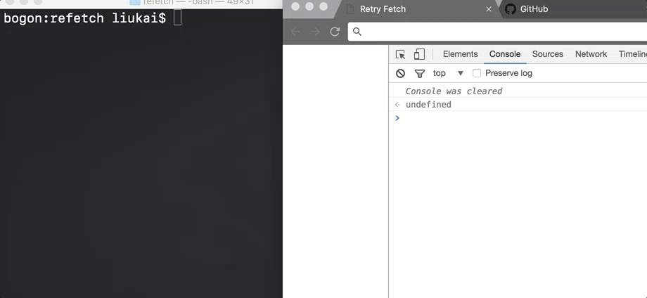

# refetch

refetch let you simply add `timeout` and `retry` method to your fetch API

<div style="align: center">
  
</div>

### Install

```shell
 npm install re-fetch --save
```

### Usage
The `url` and `options` are totally same as fetch.

```javascript
  import refetch from 're-fetch';

  //timeout is milliseconds like: 3000
  refetch(url, options, timeout, retryTimes, cb)
    .then(res => { /* ... */})
    .catch(err => {
      if(err === 'timeout'){
        /* ... */
      } else {
        /* ... */
      }
    });
```

  - `timeout`: milliseconds, default is 5000
  - `retryTimes`: try times, default is 1
  - `cb`: callback will fired each timeout, has one parameter - number of try times left

**Example in the GIF**
```javascript
  import refetch from 're-fetch';
  // the server will response the 4th time.
  refetch('http://localhost:3030/try/4', {}, 1000, 5, (n) => {
    console.log(`this is the ${5 - n} try and timeout...`);
  })
    .then(res => res.text())
    .then(text => {
      console.log(text);
    })
    .catch(err => {
      console.log(`fetch err, the error message is: ${err}`);
    });
```
